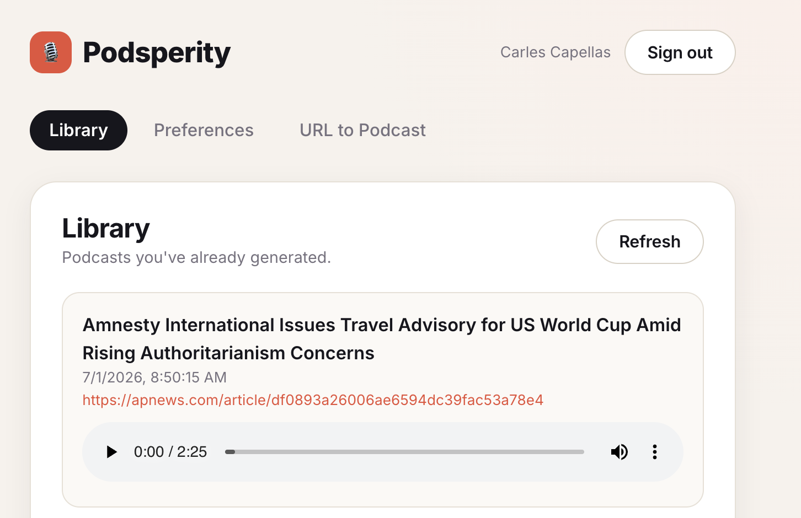
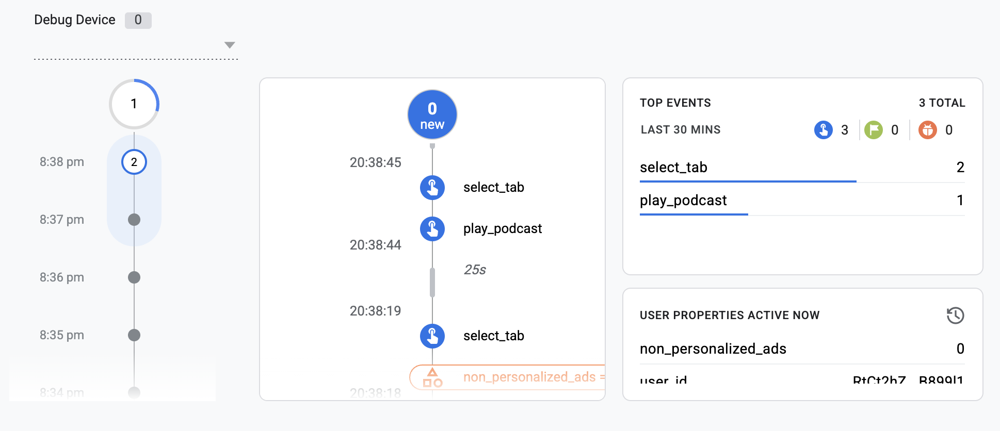

# Podsperity

[Podsperity](https://podsperity-a5b49.web.app/) is a news podcasts generator software. It turns an article URL into a short conversation between two podcast hosts. Authenticated users can select from a range of topics and generate a podcast without having to provide article URLs. Generated podcasts are available for all users to listen to.

## Architecture

The software runs entirely on Firebase:

- Hosting. Firebase serves the single page application and rewrites `/api/*` endpoints to Firebase functions
- Storage. Firebase stores the generated podcasts: mp3 audio files and JSON transcripts
- Firestore. NoSQL database that stores user preferences only
- Authentication. Google sign-in via Firebase, required to generate podcasts via topics selection

**Frontend**. React 18 + TypeScript, bundled with Vite. A single-page app with three tabs, *Library*, *Preferences* and *URL to Podcast* — served as static assets from Firebase Hosting.

**Backend**. Node 20 + TypeScript Cloud Functions, containing 3 HTTP functions:
- `generatePodcast`. Fetches the article from the given URL, writes a dialogue (OpenAI), synthesizes audio (ElevenLabs), uploads the mp3 audio file + transcript to Storage and returns a tokenized download URL.
- `listPodcasts`. Retrieves the podcasts in Storage.
- `findArticle`. Retrieve the selected topics of the authenticated user, and use OpenAI web search to return a recent, not-yet-used article URL.

## User metrics

User activity is tracked with Google Analytics through Firebase Analytics. I kept it simple and focused my efforts elsewhere. The following events are tracked:

- Sign in / out
- Tab navigation
- Podcast generation
- Podcast generation failure
- Interest selection
- Playing an existing podcast
- Playing a new podcast
- Downloading a podcast

## Next steps

- **Multiple articles in one podcast**. Currently the short podcasts contain a single piece of news. The product request was to combine several articles in one file.

- **Asynchronous generation**. The podcast is currently generated while holding an HTTP connection open. That imposes a limit on the length of the generated podcast, as HTTP requests timeout after 5 minutes. It would be better to generate the podcast asynchronously and notify the user via email when the podcast is ready.

- **Filtering capabilities**. The source of truth for the podcasts is the storage bucket. This tradeoff has allowed me to develop the MVP quickly, but it makes it difficult to sort and filter the generated podcasts. A database collection would be much more convenient for such purposes.

- **Refine Google Analytics**. I didn't invest much time on tracking the user behavior. Some efforts are needed to better understand how the applications use the software and whether there are errors that are not being captured.

- **Natural language testing**. The application is an MVP meant to be deployed quickly and tested with a small user base. Once user feedback has been gathered, the main features need to be documented via natural language testing before expanding the software.